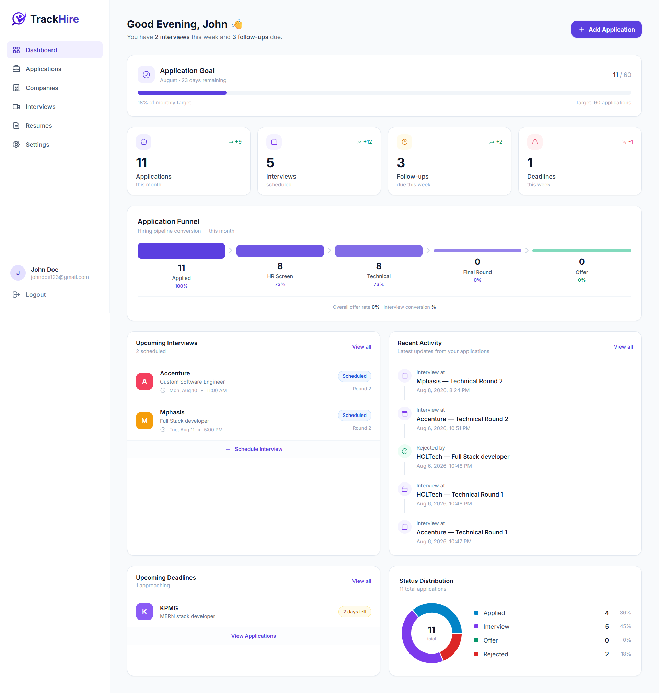
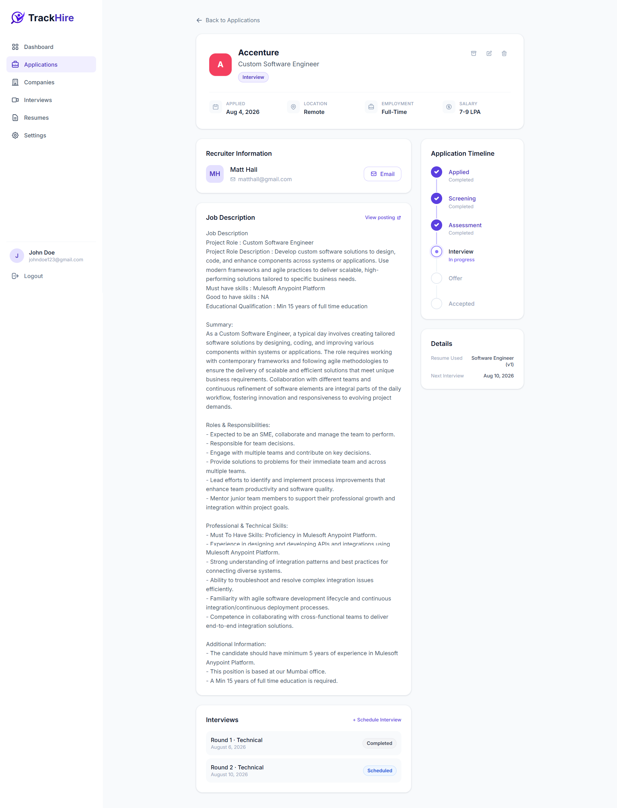
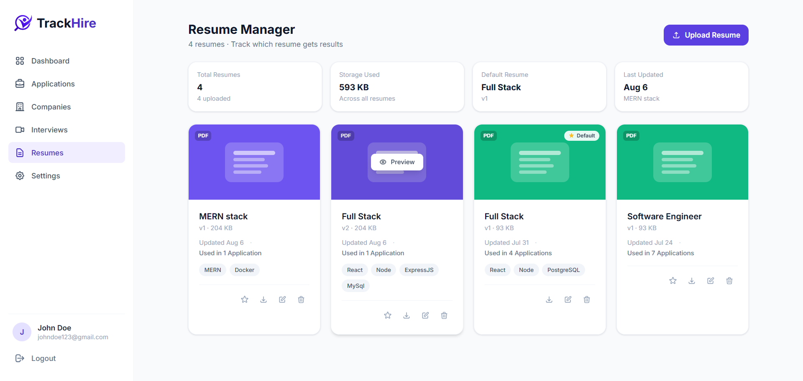
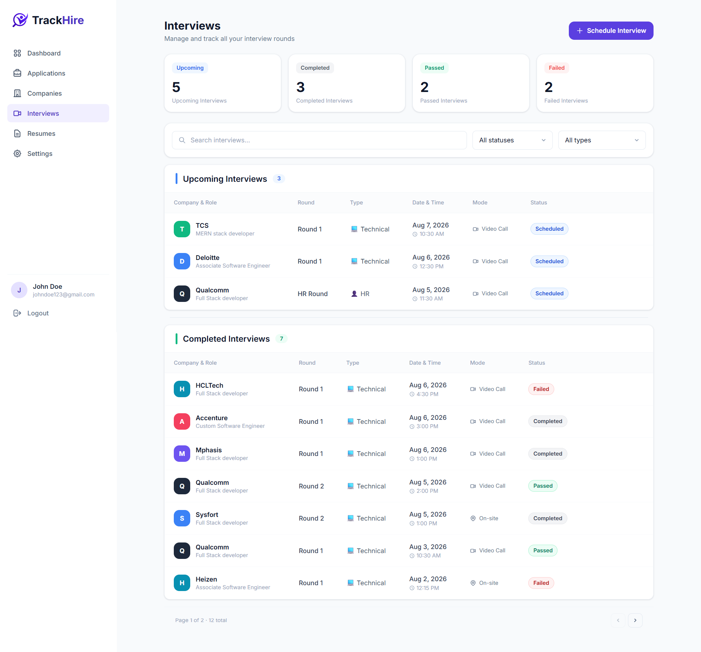

# TrackHire

A full-stack MERN application for organizing a job search in one place — applications, interview stages, recruiter details, resume versions, and progress analytics — instead of a spreadsheet.

Job searches at scale (dozens or hundreds of applications) outgrow what Excel, Sheets, or Notion can track cleanly. TrackHire centralizes that workflow with a status pipeline, interview history, and dashboard analytics computed from your actual application data.

**Repository:** [github.com/Mansi2156/TrackHire](https://github.com/Mansi2156/TrackHire)

**Live Demo:** _add deployed link here_

---

## Screenshots

### Dashboard


### Applications


### Resume Manager


### Interview Tracking


---

## Features

**Authentication**
- Register / login / logout, JWT-based sessions, protected frontend routes and backend APIs

**Job Applications**
- Create, edit, delete, archive, and bulk-manage applications
- Structured pipeline: `Saved → Applied → Screening → Assessment → Interview → Offer → Accepted`, with `Rejected` / `Withdrawn` / `Closed` as alternate outcomes
- Search, filter, sort, and server-side pagination

**Interviews**
- Multiple interview rounds per application (round, type, mode, status, notes, feedback)
- Interview outcomes automatically sync the parent application's status and interview date

**Resume Manager**
- Upload, replace, download, and preview resumes (PDF/DOCX)
- Tagging, per-user default resume, and resume-level usage stats
- Resumes are stored on local disk in development; production uses Cloudinary.

**Companies**
- Company profiles linked to applications, with search and per-company statistics

**Dashboard**
- KPI cards, pipeline funnel, status distribution, upcoming interviews, upcoming deadlines, and recent activity — computed from real user data

**Settings**
- Profile editing, password change, in-app reminder preferences, and soft account deletion

---

## Tech Stack

**Frontend:**
    React 18 (Vite) · React Router DOM · Axios · TanStack Query · React Hook Form · Tailwind CSS · React Hot Toast · Recharts · React Icons / lucide-react

**Backend:**
    Node.js · Express.js · MongoDB (Mongoose) · JWT Authentication · bcryptjs · express-validator · Multer · Cloudinary

**Database:**
    MongoDB Atlas

---

## Architecture

Layered on both sides for a clear separation of concerns:

```
Backend:  Route → Middleware (auth/validation) → Controller → Service → Model → MongoDB
Frontend: Page → Form (React Hook Form) → Context/Hooks → API layer (Axios) → Backend API
```

- **Routes** wire HTTP methods/paths to middleware and controllers only
- **Controllers** handle HTTP concerns; no business logic
- **Services** contain business logic and talk to Mongoose models
- **Middleware** handles auth, validation, and centralized error formatting

---

## Project Structure

```
TrackHire/
├── client/
│   └── src/
│       ├── api/          # Axios instance + one service file per resource
│       ├── components/   # Reusable UI components
│       ├── context/      # AuthContext (session state)
│       ├── hooks/        # TanStack Query hooks per feature
│       ├── layouts/      # Auth / Dashboard shells
│       └── pages/        # Route-level screens
└── server/
    ├── config/           # Env loading, DB connection, Cloudinary
    ├── controllers/      # HTTP request/response handlers
    ├── services/         # Business logic
    ├── models/           # Mongoose schemas
    ├── middleware/        # Auth, validation, error handling
    ├── validators/        # express-validator chains
    └── routes/            # Route definitions
```

---

## Getting Started

### Prerequisites
- Node.js 18+
- A MongoDB Atlas cluster (or local MongoDB instance)
- A Cloudinary account (production only — resumes are stored on local disk in development)

### 1. Clone the repository
```bash
git clone https://github.com/Mansi2156/TrackHire.git
cd TrackHire
```

### 2. Backend setup
```bash
cd server
npm install
```
Create a `.env` file in `server/` (see [Environment Variables](#environment-variables) below), then:
```bash
npm run dev
```

### 3. Frontend setup
```bash
cd client
npm install
```
Create a `.env` file in `client/` (see below), then:
```bash
npm run dev
```

The app runs at `http://localhost:5173` (frontend) and `http://localhost:5000/api` (backend) by default.

---

## Environment Variables

**`server/.env`**

| Variable | Required | Description |
|---|---|---|
| `MONGO_URI` | Yes | MongoDB connection string |
| `JWT_SECRET` | Yes | Secret used to sign JWTs |
| `PORT` | No | Defaults to `5000` |
| `NODE_ENV` | No | `development` or `production` |
| `JWT_EXPIRES_IN` | No | Defaults to `7d` |
| `CLIENT_URL` | No | Frontend origin, used for CORS |
| `CLOUDINARY_CLOUD_NAME` | Yes, in production | Cloudinary account identifier |
| `CLOUDINARY_API_KEY` | Yes, in production | Cloudinary API key |
| `CLOUDINARY_API_SECRET` | Yes, in production | Cloudinary API secret |

Resume files are stored on local disk in development (no Cloudinary setup needed) and in Cloudinary in production, selected automatically by `NODE_ENV`. The server fails fast on startup if the Cloudinary variables are missing in production.

**`client/.env`**

| Variable | Required | Description |
|---|---|---|
| `VITE_API_URL` | Yes | Base URL of the backend API, e.g. `http://localhost:5000/api` |

---

## Known Limitations

- No refresh-token flow; sessions expire after the configured JWT lifetime and require re-login.
- "Forgot password" is not yet implemented.
- Reminder preferences are in-app only (no email/push delivery).

---

## Roadmap (V2)

- AI-assisted resume matching and ATS scoring against job descriptions
- Email and browser notifications for interviews and follow-ups
- Calendar integration (Google/Outlook)
- Advanced analytics and historical trends

---

## License

This project is available for portfolio and educational purposes.